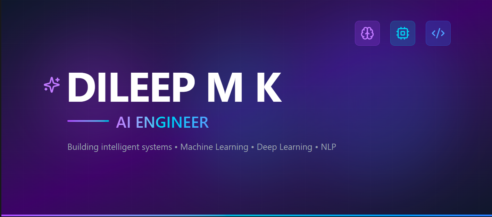

  

<h1 align="center">🌍 DILEEP M K</h1>

<h3 align="center">
Building Intelligence For Planet Earth
</h3>

<a href="https://dileepmk.netlify.app/">🌐 Portfolio</a> •
<a href="https://www.linkedin.com/in/dileep-m-k/">💼 LinkedIn</a> •
<a href="https://github.com/DileepMK-126">💻 GitHub</a>

